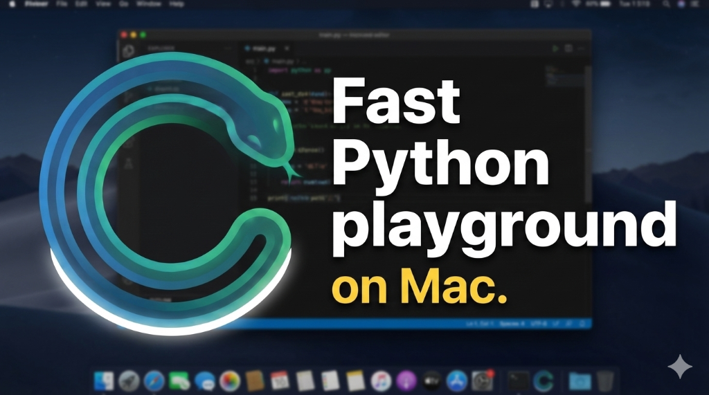
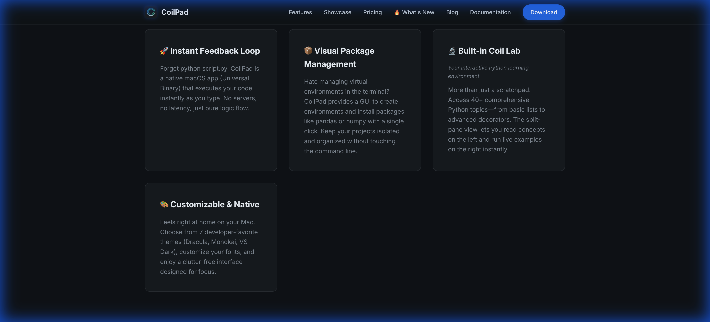
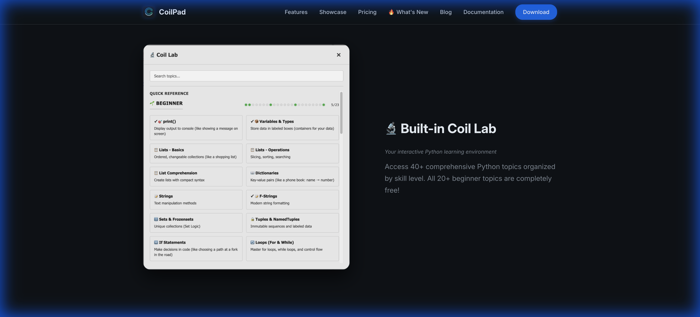
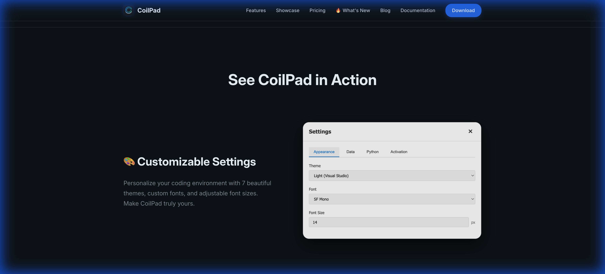
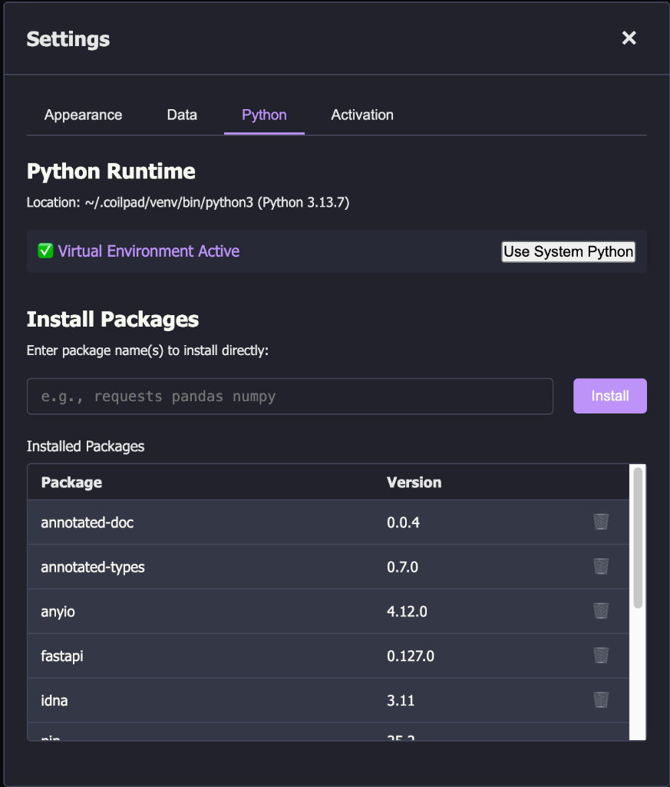

# CoilPad

[CoilPad](https://coilpad.com) is a native macOS Python playground with instant feedback and built-in 🔬 Coil Lab. Perfect for learning, experimenting, and prototyping.

## Why CoilPad?

- ⚡ **Instant Feedback** - Code executes as you type, results appear inline automatically
- 📦 **Visual Package Manager** - Install pandas, numpy, requests with one click—no terminal needed
- 🔬 **Built-in Coil Lab** - 40+ interactive Python topics from basics to advanced (decorators, async/await, SQLAlchemy)
- 🎨 **Customizable** - 7 themes (Dracula, Monokai, VS Dark) + 9 font families
- 🚀 **Multi-tab Support** - Work on multiple experiments simultaneously (Pro feature)
- 🍎 **Native macOS** - Universal binary for Apple Silicon + Intel

Download the latest release [here](https://coilpad.com/).

## Features

### Instant Feedback Loop

Write code and see results immediately—no need to manually run scripts. Output appears inline, aligned with your code.

### Built-in Coil Lab

Access 40+ comprehensive Python learning topics right from the app. From basic lists to advanced decorators, all with working examples.

### Customizable & Native

Choose from 7 developer-favorite themes and 9 font families. Designed specifically for macOS with a clutter-free interface.

### Python Runtime Management

Manage your Python environment with ease. Switch between system Python and virtual environments, and install packages visually.

## Links

- [Website](https://coilpad.com/)
- [Issue Tracker](https://github.com/ccwukong/CoilPad/issues)
- [Support](mailto:support@coilpad.com)

## Pricing

- **Free**: 1 tab, 20+ beginner topics, all core features
- **Pro ($29 launch special)**: Unlimited tabs, 40+ topics, lifetime license

[Get CoilPad Pro](https://coilpad.com/#pricing)

## About

CoilPad is a native macOS Python playground with instant feedback and built-in 🔬 Coil Lab. Perfect for learning, experimenting, and prototyping.

**Made with ❤️ for Python developers**

[coilpad.com](https://coilpad.com/)
